# Chapter2. 의존성과 계층화

```
- 메서드 수준에서 어셈블리 수준에 이르기까지 복잡한 의존성을 관리한다.
- 의존성 복잡도가 가장 높은 부분을 찾아 이를 해결하기 위한 도구를 사용한다.
- 코드 재사용을 보장할 수 있도록 코드를 더욱 작고 적응이 가능한 조각으로 분리하여 구현한다.
- 계층화 패턴을 유용하게 활용한다.
- 의존성 해석의 개념을 이해하고 의존성 관련 문제를 디버깅한다.
- 간단한 인터페이스를 통해 상세 구현을 숨기는 기법을 익힌다.
```

모든 소프트웨어는 의존성을 가지고 있다.
* first-party dependency - 같은 코드 기반
* third-party dependency - 외부 assembly
* 보편적인 의존성(ubiquitous dependency) - .Net framework

# 의존성의 정의

별개의 두 엔티티 사이의 연관 관계로 인해 어느 한 엔티티가 다른 엔티티의 기능 없이는 자신의 기능을 실행하지 못하는 관계를 의미한다.
  


## 간단한 예제
의존성을 제공하는 어셈블리가 반드시 미리 로드되어 있을 필요가 없다.

### 프레임워크 의존성
프레임워크 어셈블리는 항상 로드된다.
### 서드파티 의존성

## 유향 그래프를 이용한 의존성 모델링
무향그래프(undirected graph)

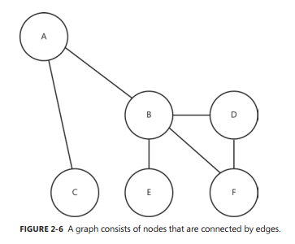

유향그래프(directed graph)/다이그래프(digraph)

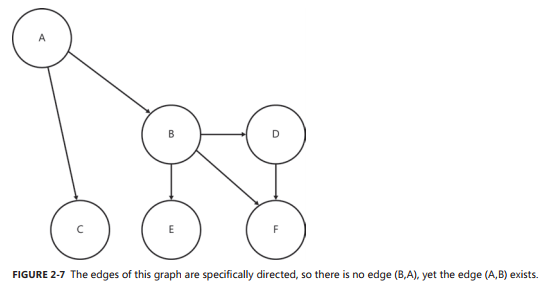


의존성 다이그래프(dependency digraph)


### 순환 의존성
순환식 다이그래프(cyclic digraph)

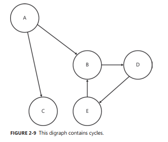

루프(loop)

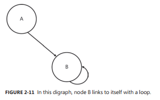


# 의존성 관리하기
_ 의존성을 제대로 관리 못하면, 나중에 큰 문제로 이어질 수 있다. (아키텍처 전체의 문제점으로 커질 수도 있다.)

## 구현과 인터페이스의 비교


## new 키워드의 코드 스멜
> 코드 스멜
> 
> `코드 스멜(code smell)`이란, 어떤 코드가 잠재적으로 문제가 있을 수 있음을 표현하는 단어이다.  
> _ 뭔가 잘못될 가능성이 있음에 대한 경고이며, 어떤 문제가 발생할 경우 그에 대한 근본적 원인이 된다.  


객체의 인스턴스를 직접 생성함으로 인해 코드의 적응성이 저하되는 예제
```cs
public class AccountController
{
    private readonly SecurityService securityService;
    public AccountController()
    {
        this.securityService = new SecurityService();
    }

    [HttpPost]
    public void ChangePassword(Guid userID, string newPassword)
    {
        var userRepository = new UserRepository();
        var user = userRepository.GetByID(userID);
        this.securityService.ChangeUsersPassword(user, newPassword);
    }
}
```
```
- AccountController 클래스는 SecurityService, UserRepository에 의존적이다.
- SecurityService와 UserRepository 클래스가 가지고 있는 의존성은 AccountController 클래스의 잠재적 의존성이 된다.
- 단위테스트 하기 어렵다.
- SecurityService.ChangeUsersPassword 메서드는 클라이언트가 User 객체를 로드할 수 밖에 없도록 만든다.
```

### 구현 향상이 불가능
### 의존성 체인
### 테스트 가능성 부재
### 보다 부적절한 결합
_ ChangeUserPassword의 인자에 User를 사용하는 것 - 잘못된 메서드 인터페이스 디자인
```cs
public class AccountController
{
    private readonly SecurityService securityService;
    public AccountController()
    {
        this.securityService = new SecurityService();
    }

    [HttpPost]
    public void ChangePassword(Guid userID, string newPassword)
    {
        this.securityService.ChangeUsersPassword(userID, newPassword);
    }
}

public class SecurityService
{
    public void ChangeUsersPassword(Guid userID, string newPassword)
    {
        var userRepository = new UserRepository();
        var user = userRepository.GetByID(userID);
        user.ChangePassword(newPassword);
    }
}
```
_ 개선이 되었다. 하지만 UserRepository 객체의 인스턴스를 직접 생성하는 문제를 가지고 있다.

## 객체 생성에 대한 대안

### 인터페이스를 기초로 한 코딩
```cs
public interface ISecurityService
{
    void ChangeUsersPassword(Guid userID, string newPassword);
}
//...
public class SecurityService : ISecurityService
{
    public ChangeUsersPassword(Guid userID, string newPassword)
    {
        //...
    }
}

// 
public class AccountController
{
    private readonly ISecurityService securityService;
    
    public AccountController()
    {
        this.securityService = new SecurityService();
    }

    [HttpPost]
    public void ChangePassword(Guid userID, string newPassword)
    {
        securityService.ChangeUsersPassword(user, newPassword);
    }
}
```
### 의존성 주입 기법 활용하기
```cs
// Using dependency injection
public class AccountController
{
    private readonly ISecurityService securityService;
    public AccountController(ISecurityService securityService)
    {
        if(securityService == null) throw new ArgumentNullException("securityService");
        this.securityService = securityService;
    }

    [HttpPost]
    public void ChangePassword(Guid userID, string newPassword)
    {
        this.securityService.ChangeUsersPassword(user, newPassword);
    }
}

public class SecurityService : ISecurityService
{
    private readonly IUserRepository userRepository;
    public SecurityService(IUserRepository userRepository)
    {
        if(userRepository == null) throw new ArgumentNullException("userRepository");
        this.userRepository = userRepository;
    }
    public ChangeUsersPassword()
    {
        var user = userRepository.GetByID(userID);
        user.ChangePassword(newPassword);
    }
}
```

## 추종자 안티패턴(Entourage anti-pattern)
_ 인터페이스와 그에 관련된 의존성등은 **동일한 어셈블리에 존재해서는 안된다.**

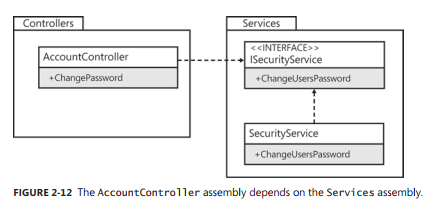

안티패턴의 문제점  
1. 각 패키지의 인터페이스들이 모두 public 인터페이스로 구현되어야 한다.
2. (동일한 어셈블리에 새로군 구현체를 추가하면) 코드의 덩치가 커지고 깨지기 쉬워져, 새로운 요구사항을 수렴하기 어렵게 된다.

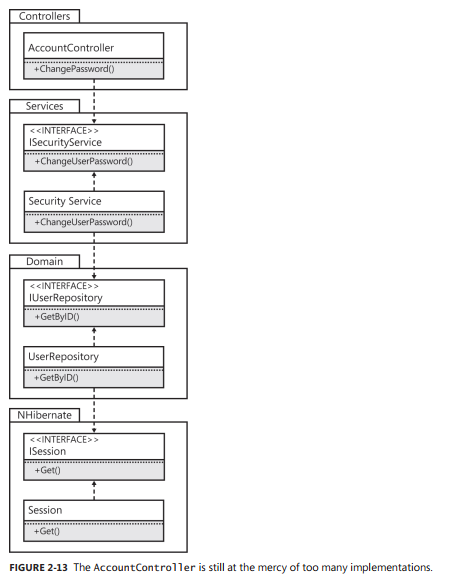

## 계단 패턴

Stairway Pattern은 클래스와 인터페이스를 관리하는 올바른 방법이다.

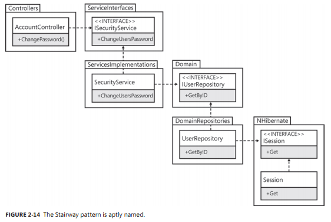

_ 구현체(클래스)는 자신이 의존하는 인터페이스가 정의된 어셈블리만 참조한다.  
_ 구현 클래스는 자신이 구현할 인터페이스가 정의된 어셈블리를 참조한다. 


인터페이스는 어떠한 외부 의존성도 가져서는 안 된다.  
인터페이스는 참조하는 서드파티 라이브러리에 정의된 어떤 데이터 객체나 클래스도 속성이나 메서드를 통해 노출해서는 안된다.  
인프라스트럭처에 관련된 엔티티들을 참조하는 것 역시 피해야한다. (추종자 안티패턴)

## 의존성 해석하기

### 어셈블리

#### 해석프로세스
_ CLR은 JIT(Just-In-Time)모델을 이용해 어셈블리를 해석한다. 애플리케이션을 시작하는 시점이 아닌 어셈블리 기능을 사용할 때 수행함  
_ 각 어셈블리는 이름, 버전, 컬처, 공개 키 토큰 등으로 고유하게 식별된다.  
_ 식별자를 확보하면 애플리케이션이 실행된 후 동일한 의존성에 대한 해석이 시도된 적이 있었는지를 판단할 수 있다.
```xml
<!-- Visual Studio -->
<reference include="MyAssembly, Version=2.1.0.0, Culture=neutral, PublicKeyToken=17fac983cbea459c" />
```
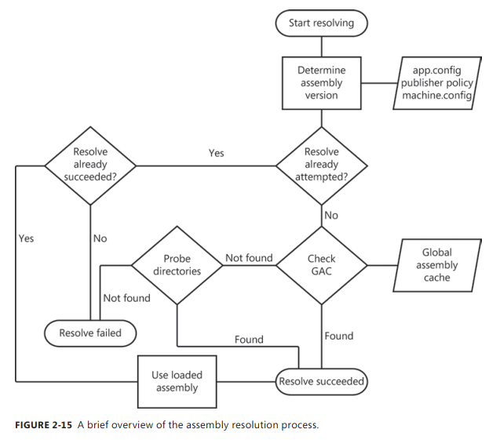  


#### 퓨전 로그(fusion log)
CLR이 런타임 시점에 실패했던 어셈블리 바인딩을 디버깅하기 위한 매우 유요한 도구이다.  

```
HKLM\Software\Microsoft\Fusion\ForceLog 1
HKLM\Software\Microsoft\Fusion\LogPath C:\FusionLogs
```
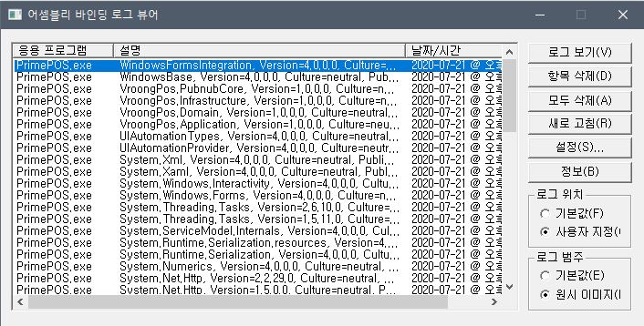  


### 서비스
어셈블리에 비해 클라이언트와 호스트 서비스의 결합은 비교적 느슨한 결합이며 더 낫지만, 이 역시 비용이 수반된다.

#### 알려진 종단점(known endpoint)

#### 서비스 발견(service discovery)

## NuGet을 이용한 의존성 관리
의존성 관리도구

#### Chocolatey
애플리케이션 도구를 패키지로 관리하는 도구 https://chocolatey.org
- 간편한 설치
- 의존성 관리
- 손쉬운 사용


# 계층화
`계층화(layering)`은 소프트웨어 컴포넌트를 각 기능의 수평적 계층으로 취급하고 이들을 바탕으로 전체 애플리케이션을 구성해 나가도록 유도하는 아키텍처 패턴이다.  
의존성 방향은 항상 아래를 향한다.

## 일반적인 패턴

### 두 개의 계층
  

계층화된 아키텍처에서는 하위 계층에 대한 의존성만을 가질 수 있다.

#### 사용자 인터페이스
역할
- 사용자가 애플리케이션을 사용하기 위한 방법을 제공한다.
- 사용자에게 데이터와 정보를 표시한다
- 사용자의 요청을 질의나 명령 형태로 받아들인다
- 사용자가 입력한 정보에 대한 유효성을 검사한다.


사용자 인터페이스 계층은  
_ 데이터 액서스 계층 위에 존재하며, 하위 계층의 기능을 사용할 수 있다.  
_ 데이터 액서스 계층을 구현한 어셈블리를 직접 참조할 수 없다.  
_ 각 계층의 인터페이스와 실제 구현 어셈블리는 반드시 분리되어야 한다.
  

#### 데이터 액서스
역할
-  데이터에 대한 질의를 제공한다
-  객체 모델과 관계형 모델 간의 직렬화/역직렬화를 수행한다.

주로 
- 영구적(persistent) 데이터 저장소 포함
- 쿼리를 실행하거나 저장 프로시저(stored procedure)를 호출해 추가/수정/삭제 작업을 수행하거나 관계형 DB와 매핑하는 작업을 수행하는 어셈블리가 포함


**two-layer architecture**가 유용할 때
- 애플리케이션 로직이 거의 없는 경우. - 데이터 액세스 계층이나 사용자 인터페이스 계층을 손쉽게 캡슐화할 수 있다.
- 애플리케이션이 주로 데이터에 대한 CRUD 작업만 수행하는 경우.
- 기간이 짧은 경우.

**two-layer architecture** 단점
- 애플리케이션이 방대한 로직을 가지고 있거나 로직의 주제가 변경되는 경우.
- 애플리케이션이 한두 번의 스프린트를 거쳐 두 계층 이상으로 방대해지는 경우.

간단한 애플리케이션에서는 좋다.

### 세 개의 계층
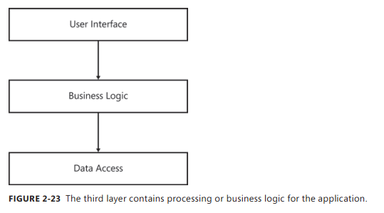  

#### 비즈니스 로직
역할
- 사용자 인터페이스 계층으로부터 명령을 처리한다.
- 비즈니스 도메인을 모델링하여 비즈니스 프로세스, 규칙, 업무 흐름 등을 정의한다.

도메인 모델을 적용하여 개발, 도메인 주도 디자인(DDD)을 적용하는 것이 일반적  
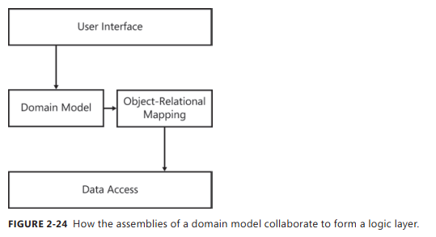  

로직계층을 추가해야 하는 경우
- 복잡한 로직을 애플리케이션에 구현해야 할 때
- 복잡하지 않더라도 변경이 잦을 때 - 이를 캡슐화하기 위해 별도의 계층을 사용 

## 횡단 관심사
이미 배포되어 있는 애플리케이션을 추적하려면 로그를 기록하여 디버깅할 수 있지만, 실수를 범하기도 하고 장황한 코드가 추가되어야 한다.  
-> `횡단 관심사(cross-cutting concerns)`의 요건들을 정의하고 이들을 캡슐화된 기능으로 떼어 내어 코드에 적용  
-> AOP 적용

### 관점
관점지향 프로그래밍(AOP, Aspect-Oriented Programming)은 횡단 관심사(혹은 관점)를 코드내의 여러 계층에 적용하는 방법

```cs
[Logged] // 메서드 호출에 대한 기록을 로깅
[Transactional] // 이 메서드를 데이터베이스 트랜잭션으로 감싸고, 메서드 호출이 성공하면 트랜잭션을 커밋, 실패하면 롤백
public void OpenNewAccount(Guid ownerID, string accountName, decimal openingBalance)
{
    var user = userRepository.GetByID(ownerID);
    user.CreateAccount(accountName);
    var account = user.FindAccount(accountName);
    account.SetBalance(openingBalance);
}
```

## 비대칭 계층화
최근 대중화 되고 있는 명령/질의 책임 격리 패턴(CQRS)

### 명령/질의 분리 (CQS, Command Query Separation)
> 객체의 메서드는 반드시 명령 혹은 질의 중 하나여야 한다. by Bertrand Meyer <객체지향 소프트 웨어 설계, 1977>

**명령**
- 어떤 동작을 위해서 의무적으로 호출해야 하는 것으로 코드로 하여금 필요한 작업을 실행
- 시스템의 상태를 변경할 수는 있지만 값을 리턴하면 안 됨

```cs
// Compliant command
Public void SaveUser(string name)
{
    session.Save(new User(name));
}
// Non-compliant command
public User SaveUser(string name)
{
    var user = new User(name);
    session.Save(user);
    return user;
}
```

**질의**
- 데이터에 대한 요청이며, 코드로 하여금 필요한 데이터를 가져오게 한다.
- 자신을 호출한 클라이언트에게 데이터를 리턴
- 시스템의 상태를 변경해서는 안 된다.
  
```cs
// Compliant query
Public IEnumerable<User> FindUserByID(Guid userID)
{
    return session.Get<User>(userID);
}
// Non-compliant query
public IEnumerable<User> FindUserByID(Guid userID)
{
    var user = session.Get<User>(userID);
    user.LastAccessed = DateTime.Now;
    return user;
}
```

명령과 질의는 리턴 값의 존재 여부로 구분

### 명령/질의 책임 격리 (CQRS, Command Query Responsibility Segregation)
CQS와 동일한 규칙을 따르지만, CQRS는 한 걸음 더 나아가 명령과 질의는 각각을 잘 처리할 수 있는 계층화의 경로를 따를 필요가 있다는 점을 함께 고려하고 있다.

예제
- 도메인 모델을 바탕으로 한 3계층 아키텍처를 구현할 때 적용할 수 있다.
- 도메인 모델은 애플리케이션의 명령 측 영역에서만 사용
- 질의 측 영역에는 2계층 모델이 사용

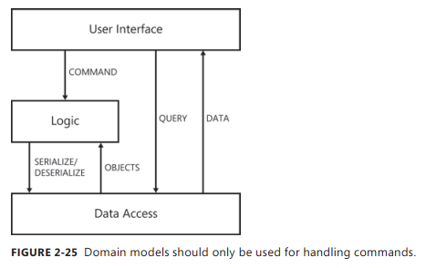  

데이터에 대한 질의
- 대체로 빠르게 수행되어야 하며, 트랙잭션 동시성에 대한 보장이 필요하지 않다.
- 즉, 응답성을 향상시키기 위해 팬텀 읽기(phantom read)나 반복하지 않는 읽기(non-repeatable read)를 허용할 수 있다.

명령의 처리
- 트랜잭션 동시성이 보장되어야하므로 명령과 질의 처리는 서로 다른 계층을 사용

명령 측 영역에서는 ACID(Atomic, Consistent, Isolated, Durable)를 완벽히 지원하는 데이터베이스를 사용, 잘의 측 영역에서는 간단한 도큐먼트 저장소를 사용할 수 있다.


# 마치며
의존성 구조가 소프트웨어 애플리케이션을 개발할 때 심각한 문제점을 유발할 수 있다.  
의존성은 반드시 관리되어야 한다.
